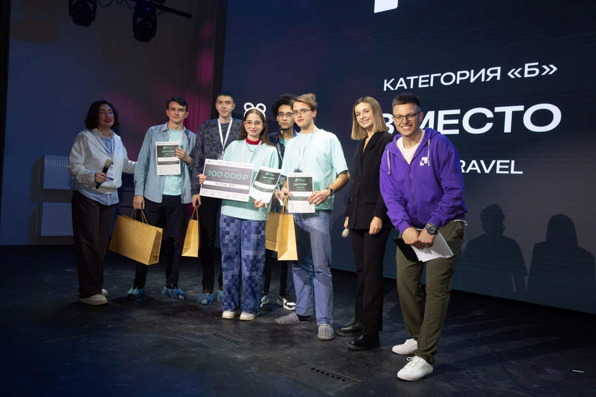
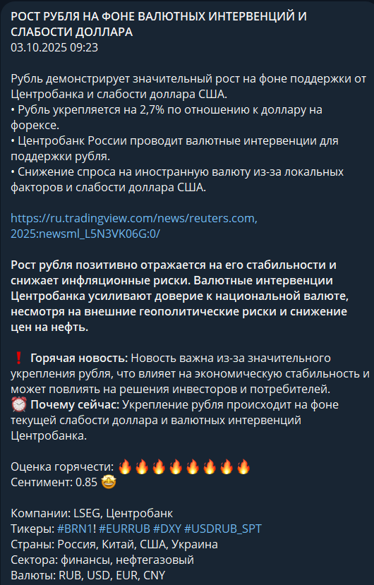
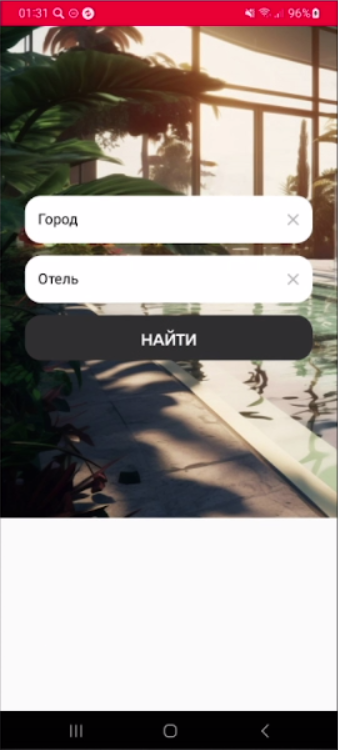
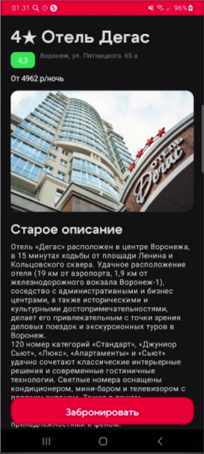
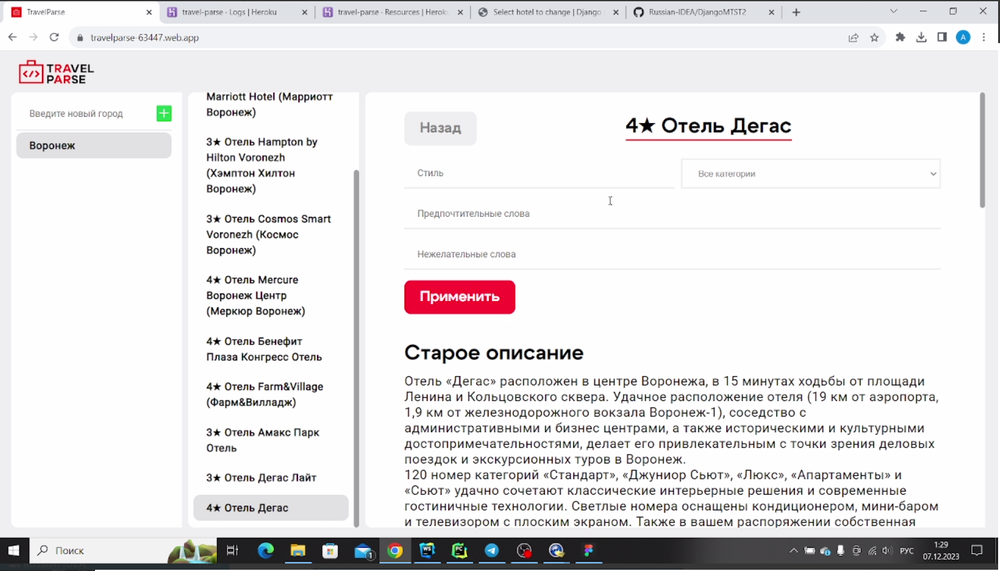
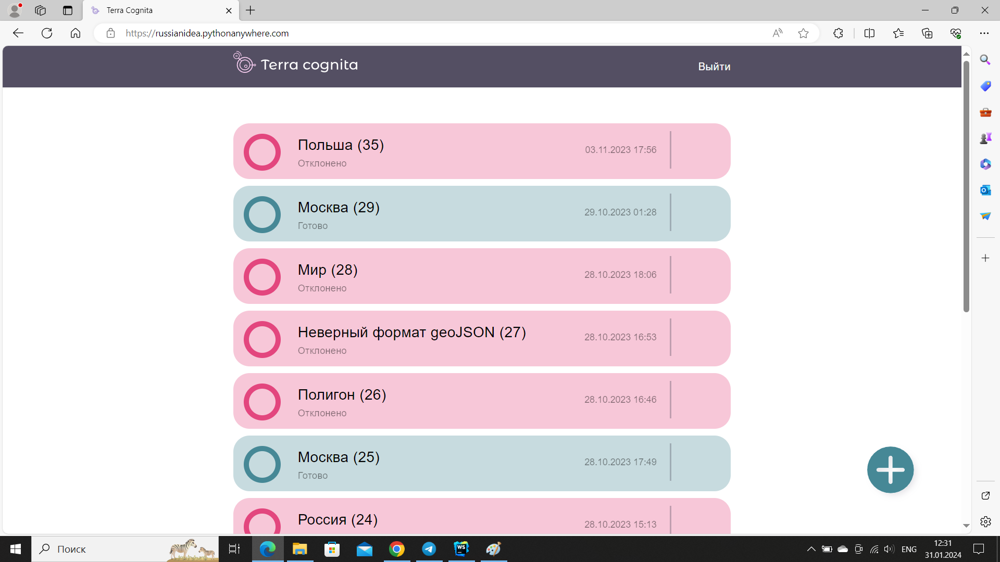
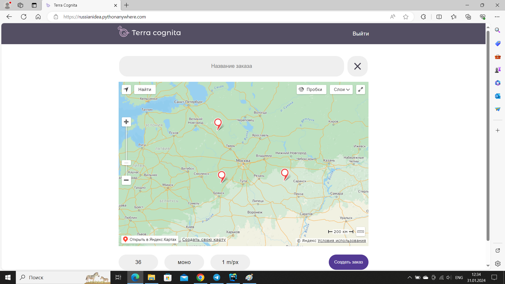
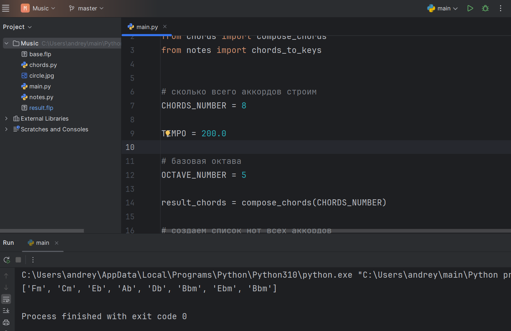

<h1>Дементьев Андрей Дмитриевич</h1>

<h3>Воронеж, 19 лет</h3>
<h3>Начинающий разработчик</h3>
<h3>Образование:</h3>
Воронежский государственный университет 
Факультет компьютерных наук 
Направление: программная инженерия 
3 курс
<h3>Бэкграунд:</h3>
<ul>
    <li>Обучаюсь программированию и разработке уже >4 лет</li>
    <li>Понимаю принципы хорошего написания кода, такие как SOLID, DRY, YAGNI, KISS (читал Чистый код и Чистую 
    архитектуру Роберта Мартина)</li>
    <li>Имею опыт использования git в командной разработке и несколько командных проектов в 
    портфолио</li>
</ul>
<h3>Языки программирования:</h3>
На глубоком уровне: <b>Java, Python</b> 
Имел опыт: <b>JS, Kotlin, Solidity</b>

Владею HTML, CSS, SQL

<h4>Уровень английского: <a href="https://disk.yandex.ru/i/3PaIluq00IfTOA">B2</a></h4>
<h3>Опыт работы:</h3>
<ul>
    <li>
        06.2025-09.2025: <b>Стажировка в 🎵 Яндекс Музыке 🎵 в команде продуктового бэкенда</b> 
        Работал с монолитной и микросервисной архитектурой 
        Технологии: <b>Spring, MongoDB, gRPC, JUnit, Mockito, Postman</b>
    </li>
</ul>
<h3>Пройденные курсы:</h3>
<ul>
    <li><a href="https://disk.yandex.ru/i/CmshtTaNnDJ-kw">IT-школа Samsung</a></li>
    <li><a href="https://disk.yandex.ru/i/Ltr8u_cqfpVIDw">Kotlin for Android Bootcamp</a></li>
    <li><a href="https://hyperskill.org/profile/39616141">Jetbrains Academy</a></li>
    <li><a href="https://disk.yandex.ru/i/e1AWvACi5J5dLQ">DSR .NET School</a></li>
    <li><a href="https://disk.yandex.ru/d/Gu0DSm6WtlFuyg">Surf QA Summer School</a></li>
    <li><a href="https://disk.yandex.ru/i/1BnPJUKc-rViHA">Surf QA Winter School</a></li>
    <li><a href="https://yadi.sk/i/v2kh7mSmXQJQRg">Яндекс Тренировки по алгоритмам 6.0</a></li>
    <li><a href="https://disk.yandex.ru/i/sP5jA9SUB9vRYg">Т-Образование: Алгоритмы и структуры данных</a></li>
</ul>
<h3>Достижения:</h3>

3-е место в финале всероссийского конкурса "Моя профессия - ИТ"

Нашёл баг в <a href="https://hackerone.com/wallet_on_telegram?type=team">Bug Bounty</a> от Telegram Wallet
<h3>Портфолио:</h3>

<a href="https://github.com/Finam-Hackathon/RussianIDEA">Агрегатор горячих финансовых новостей</a> (Python, RabbitMQ, MongoDB, ML, Selenium, JS)

 Написан на Финам хакатоне за 2 дня в небольшой команде, которой я руководил 

<a href="https://github.com/andreydem0505/3DViewer">3D рендер</a>: софт для просмотра, редактирования и анимирования 3D 
моделей <b>(Java)</b>

    
<a href="https://github.com/andreydem0505/HomeController">Мобильное приложение</a>, 
    контролирующее состояние окружающей среды <b>(Android, Kotlin, Jetpack Compose, Spring Boot)</b>
 
    Создано за неделю командой из 5 человек на <a href="https://www.innovationcampus.ru/android-bootcamp/">Kotlin for Android Bootcamp</a> от Samsung. Затем переписано мной заново.

<a href="https://github.com/andreydem0505/TradeMate">Мобильное приложение</a>
для мерчендайзеров: выпускной проект IT-школы Samsung <b>(Android, Java, Spring Boot)</b>

    
Сервис для генерации уникальных описаний отелей: 
    <a href="https://github.com/Russian-IDEA/TravelParse-mobile">мобильное приложение</a> и фронтенд 
    <a href="https://github.com/Russian-IDEA/TravelParse-Web">сайта</a>
    <b>(Android, Kotlin, Jetpack Compose, React.js)</b>
 
    
    
    
     Написан на хакатоне за 2 недели

    
<a href="https://github.com/Russian-IDEA/terra_cognita">Сервис</a> 
    для заказа фотографий со спутников <b>(Django, React.js)</b>
 
    
    
     Написан на хакатоне за 3 дня 

<a href="https://github.com/andreydem0505/Blockchain-Java">Модель блокчейна</a> <b>(Java)</b>

<a href="https://github.com/andreydem0505/Trading-bot">Торговый бот</a> на KuCoin <b>(Python)</b>

<a href="https://github.com/andreydem0505/Songwriter">Скрипт</a>, сочиняющий мелодию для FL Studio <b>(Python)</b>

<h3>Контакты:</h3>

