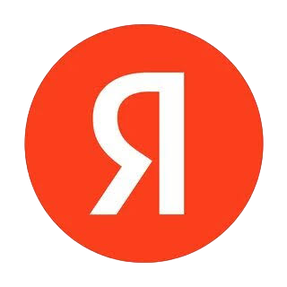
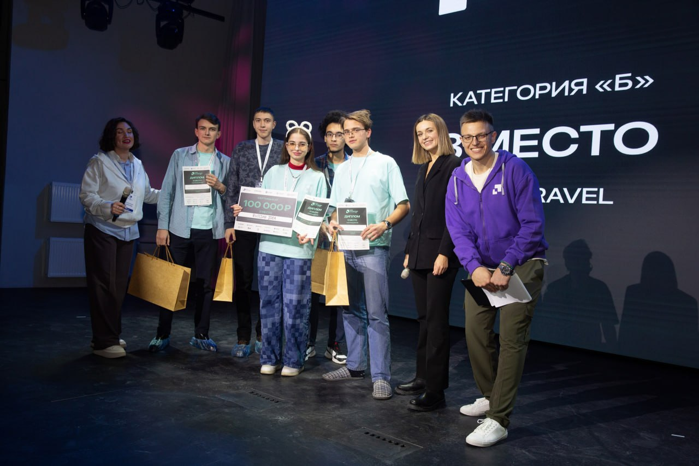

<h1>Дементьев Андрей Дмитриевич</h1>

<h3>Middle QA engineer</h3>
<h3>Воронеж, 21 год</h3>
<h3>Образование:</h3>
Воронежский государственный университет 
Факультет компьютерных наук 
Программная инженерия 
4 курс
<h3>Контакты:</h3>

<h3>О себе:</h3>
Работал в крупнейших российских компаниях. Выступал тест-лидом функциональности команды: разрабатывал тестовую модель и повышал стабильность e2e-тестов. Внедрил кэширование тестовых пользователей, ускорившее прогоны в 6 раз, и организовал внедрение подхода в других командах по всей компании.

<h3>Опыт работы (официальный, есть в трудовой книге):</h3>
<h3>&nbsp;02.26-11.26: Авито Работа — QA-инженер в кросс-функциональной продуктовой команде (удалённо)</h3>
<ul>
    <li>Выступал тест-лидом функциональности команды: разрабатывал тестовую модель, учитывая пирамиду тестирования.</li>
    <li>Участвовал в запуске нескольких масштабных АБ-экспериментов, отмечая проблемы, которые прямо влияли на бизнес-метрики.</li>
    <li>Стабилизировал e2e тесты, в частности, оплату в них (снизил flaky rate до ≈5%).</li>
    <li>Внедрил кэширование тестовых пользователей в e2e тестах, что ускорило прогоны в 6 раз. Это сократило время выхода продукта на рынок и сделало тесты менее зависимыми от проблем инфраструктуры. Популяризировал подход, организовав кросс-командное внедрение. Впоследствии проект вышел на уровень всей компании, адаптировавшись в разных вертикалях.</li>
    <li>Отметил проблемы метрик надежности, которыми пользовались все инженеры компании. Это сподвигло быстрее перейти на новые метрики и избавило мониторинг от ложноположительных показателей.</li>
    <li>Сконфигурировал канареечные релизы в 8 микросервисах, внедрив адаптивные пороги отката.</li>
    <li>Применял ИИ-агентов во всех рабочих процессах, разрабатывал ИИ-навыки.</li>
 
Стек: <b>Postman, TypeScript, Go, Proxyman, Charles, DevTools, Atlassian</b>
</ul>
<h3>&nbsp;06.25-09.25: Яндекс Музыка — разработчик в продуктовой backend-команде (офис)</h3>
<ul>
    <li>Увеличивал тестовое покрытие. Покрывал код модульными и сквозными автотестами.</li>
    <li>Разработал проект геотаргетинга лендинга Музыки с нуля — от проектирования до реализации, тестирования и внедрения. Теперь контент главной страницы сервиса зависит от города пользователя и настраивается через админку.</li>
    <li>Участвовал в переносе контент-админки (треки, альбомы, исполнители и т. д.) со старого стека на новый, улучшив пользовательский опыт контент-менеджеров.</li>
    <li>Проводил рефакторинг монолита.</li>
    <li>Одним из первых в команде применил ИИ-агента для написания кода.</li>
 
Стек: <b>Java Spring, MongoDB, JUnit, Mockito, Postman</b>
</ul>
<h3>Достижения:</h3>

3-е место в финале всероссийского конкурса "Моя профессия - ИТ"

Нашёл баг в <a href="https://hackerone.com/reports/3129921">Bug Bounty</a> от Telegram Wallet

<h3>Пройденные курсы:</h3>
<ul>
    <li><a href="https://disk.yandex.ru/i/CmshtTaNnDJ-kw">IT-школа Samsung</a> (2020-2021)</li>
    <li><a href="https://disk.yandex.ru/i/Ltr8u_cqfpVIDw">Kotlin for Android Bootcamp</a> (2021)</li>
    <li><a href="https://hyperskill.org/profile/39616141">Jetbrains Academy</a> (2020-2022)</li>
    <li><a href="https://disk.yandex.ru/d/Gu0DSm6WtlFuyg">Surf QA Summer School</a> (2024)</li>
    <li><a href="https://yadi.sk/i/v2kh7mSmXQJQRg">Яндекс Тренировки по алгоритмам 6.0</a> (2024)</li>
    <li><a href="https://disk.yandex.ru/i/1BnPJUKc-rViHA">Surf QA Winter School</a> (2025)</li>
    <li><a href="https://disk.yandex.ru/i/sP5jA9SUB9vRYg">Т-Образование: Алгоритмы и структуры данных</a> (2025)</li>
</ul>
